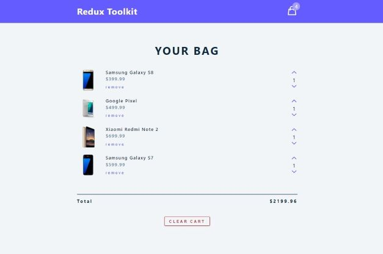
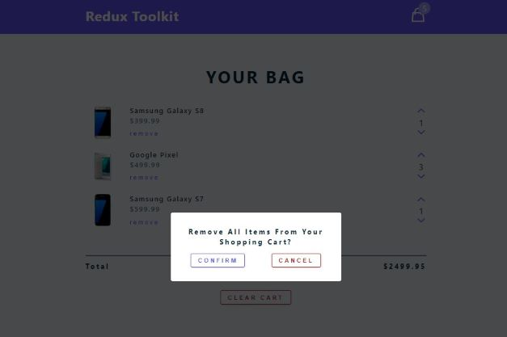

# React & Redux - Shopping Cart Component

[This project](https://gurhanalan.github.io/React-Redux-ShoppingCart-Component/) is a shopping cart component. This component is build with using React.

## Table of contents

- [React & Redux - Shopping Cart Component](#react--redux---shopping-cart-component)
  - [Table of contents](#table-of-contents)
  - [Overview](#overview)
    - [The challenge](#the-challenge)
    - [Screenshots](#screenshots)
    - [Links](#links)
  - [My process](#my-process)
    - [Built with](#built-with)

## Overview

### The challenge

Users should be able to:

- Add items to the cart
- Remove items from the cart
- Change the item amounts in the cart

### Screenshots

 
 

### Links

- Solution URL: [Live Website](https://gurhanalan.github.io/React-Redux-ShoppingCart-Component/)

## My process

### Built with

- React
- Redux Toolkit
- Functional Components
- CSS
- React Hooks
